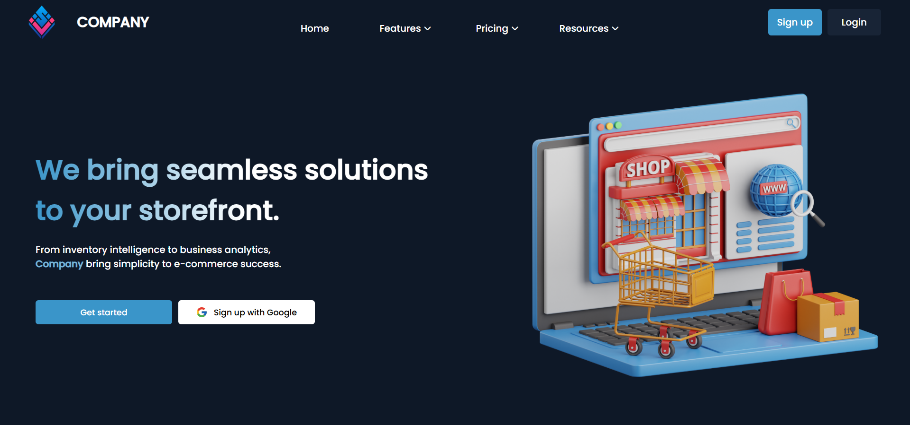
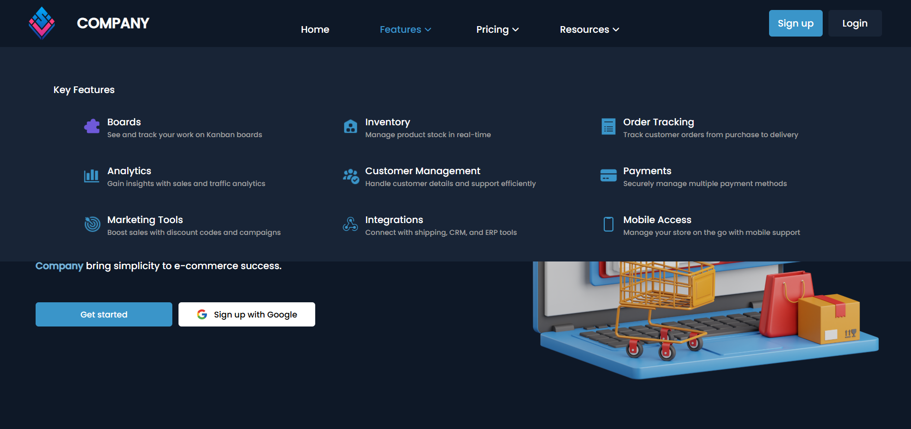
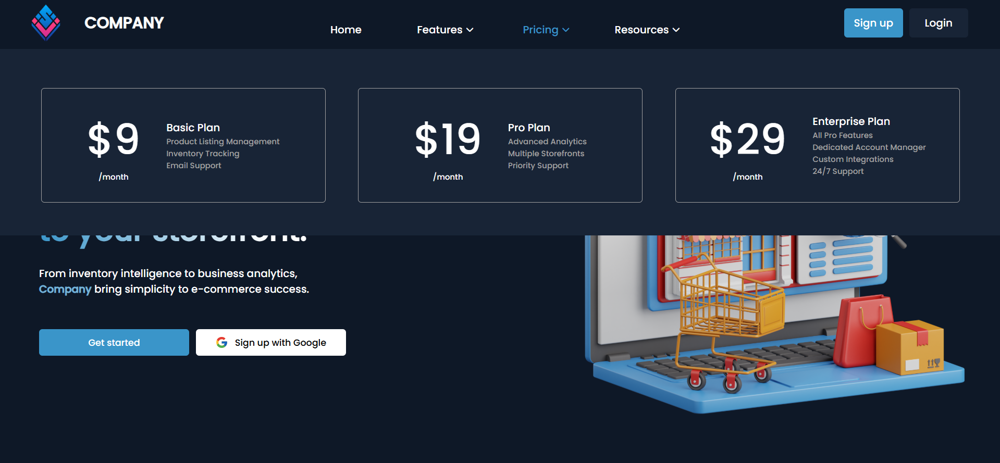
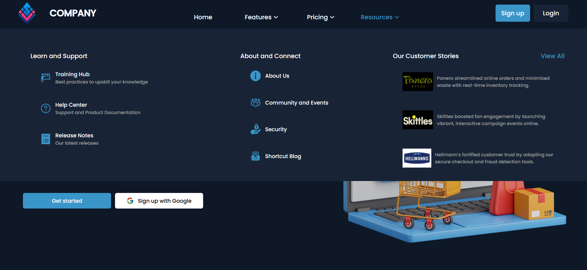

# 🌐 Mega Menu UI Component

This project is a **sample implementation** of a dynamic **Mega Menu** component designed with an e-commerce management dashboard theme. The focus is on **optimization through modularization, structured data usage, and redundancy reduction** — making the codebase ideal for scalable and maintainable large-scale web applications.

---

## 🔗 Live Demo

👉 [View Live Project]([https://your-deployment-link.com](https://mega-menu-two.vercel.app/))

---

## 🧩 Key Features

- **Dynamic Mega Menu** with hover-triggered multi-column dropdowns
- **E-commerce-Themed UI** sections like **Features**, **Resources**, and **Pricing**
- **Highly Modular Codebase** — HTML, CSS, and JavaScript files are cleanly separated
- **Optimized Through Structured Data** — Menus are dynamically populated using JSON-like arrays
- **Redundancy-Free Architecture** — One source of truth for all dropdown data prevents repetition
- **Scalable & Reusable Components** — Ideal for projects that require frequent UI updates or feature expansion

---

## ⚡ Optimization Highlights

- 🔁 **No Repetition in HTML:** All dropdown content is rendered using structured JS data, not hardcoded in HTML.
- 🧱 **Component-Based Design:** Each menu section (features, pricing, resources) is handled by its own script and dataset.
- 📁 **Centralized Data Management:** Data files like `featureData.js`, `pricing.js`, and `resourcesData.js` contain all content logic — making updates and debugging faster and more manageable.
- 🔄 **Easier Future Scaling:** Adding or removing menu sections only requires editing a data file, not rewriting UI logic.
- 🧩 **Reusable Rendering Logic:** Common functions and rendering logic are written once and reused across sections.

---

## 🖼️ Screenshots

### 💡 Landing Section

### 🧮 Features Dropdown

### 📊 Pricing Dropdown

### 📚 Resources Dropdown

---

## 🗂️ Project Structure

-- mega-menu 
--    -> images
--    -> screenshots
--    -> scripts
--            ->featureData.js
--            ->index.js
--            ->pricing.js
--            ->resourcesData.js
--    -> styles
--            ->styles.css
--    -> index.html
--   -> readme.md
